# Airbnb London Pricing Analysis
## What Drives Nightly Rates?

---

# The £127 Question

> A 2-bedroom flat in Camden sleeps 4 guests.
> Should the host charge £85 or £127 per night?

**This analysis answers that question with data.**

---

# One Slide Summary

| If you remember nothing else... |
|--------------------------------|
| **Room type is king:** Entire homes command **52-75% premiums** over private/shared spaces |
| **Size scales linearly:** Each guest capacity = **+12%** price, each bedroom = **+18%** |
| **Model accuracy:** 73% of predictions within one price tier |
| **R² = 0.50:** Half the story told by 6 variables; the other half needs amenities, reviews, exact location |

---

# Team

| Name | Role |
|------|------|
| Abel Murad | Data Loading & EDA |
| Kartavya Jharwal | Model Development |
| Muazzamkhon Mirdjamalova | Technical Documentation |
| Rakhila Sayemkozhina | Literature Review |
| Abdul Rafay Malik | Business Interpretation |
| Puck Schulten | Visualization |

**Course:** BAN-0200 • **Professor:** Glen Joseph • **Institution:** Hult International Business School

---

# The Data at a Glance

| Metric | Value |
|--------|-------|
| **Listings analyzed** | 6,319 |
| **Source** | Inside Airbnb (public data) |
| **Geography** | All 33 London boroughs |
| **Price range** | £10 – £9,999 / night |
| **Median price** | £75 / night |

**Sampling:** Stratified by neighbourhood and room type to preserve market representation.

---

# The Problem: Price is Messy

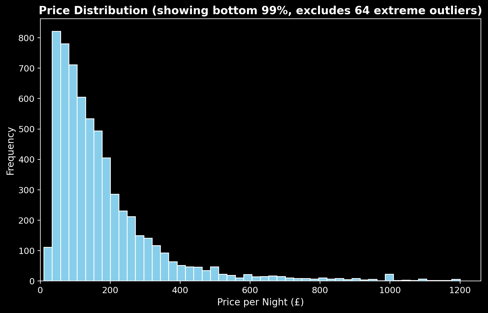

**What the histogram shows:**
- Extreme right skew (long tail of luxury listings)
- Median (£75) << Mean (£102)
- Top 1% above £500/night

**Our response:** Log-transform the target variable to stabilize variance.

*"When the data screams skewness, the analyst whispers logarithms."*

---

# Outlier Detection: The Boxplot View

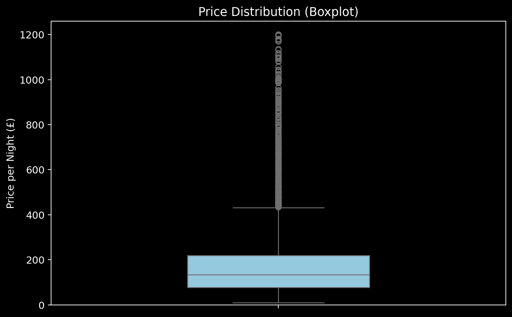

**Key observations:**
- IQR: £50–£125 (where 50% of listings fall)
- Upper fence: ~£200 (outliers above this)
- Extreme outliers: £500+ luxury listings

**Action taken:** Capped at £1,000/night for modeling stability.

---

# Room Type: The Dominant Signal

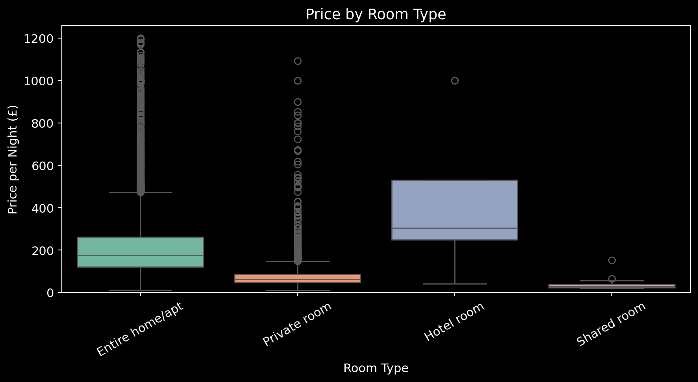

| Room Type | Avg. Price | vs. Entire Home |
|-----------|------------|-----------------|
| **Entire home/apt** | £139 | — |
| **Private room** | £67 | −52% |
| **Shared room** | £56 | −60% |

**Business insight:** Privacy is worth more than any amenity. Hosts offering entire homes operate in a fundamentally different market than room-sharers.

---

# Size Matters (Linearly)

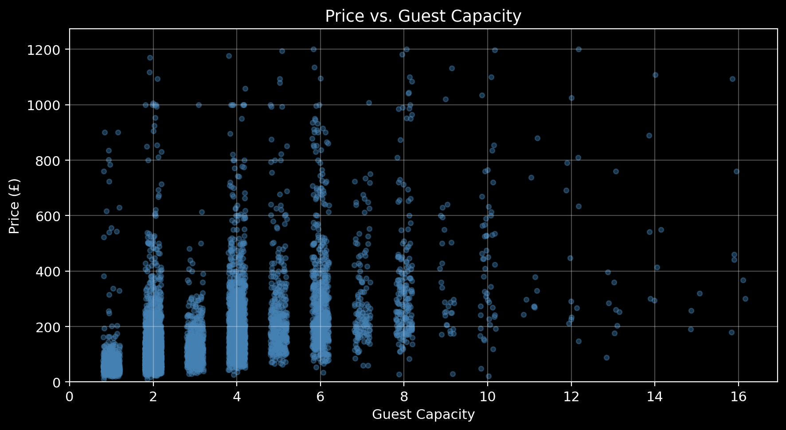

**The pattern:**
- 2 guests → £75/night
- 4 guests → £115/night (+53%)
- 6 guests → £185/night (+147%)

**Rule of thumb:** Each additional guest capacity = **+12% price premium**

This is remarkably consistent across the dataset.

---

# Bedrooms: The Privacy Premium

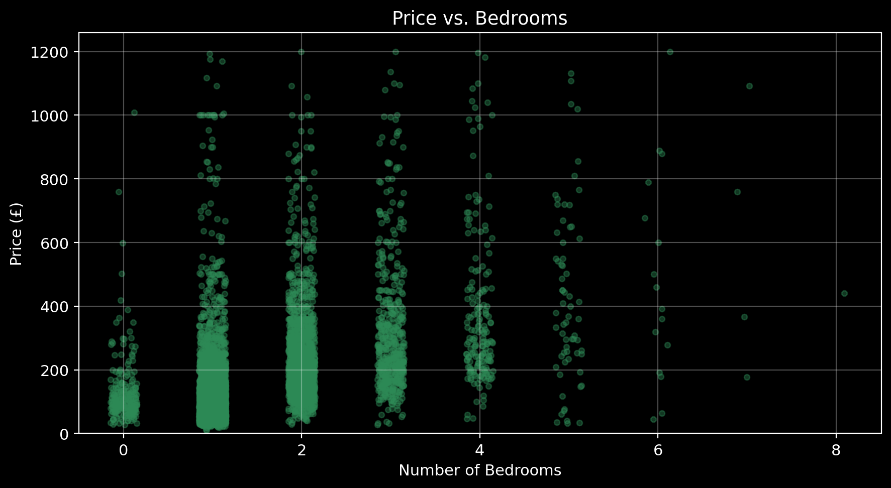

**The pattern:**
- 1 bedroom → £85/night (base)
- 2 bedrooms → £125/night (+47%)
- 3+ bedrooms → £175/night (+106%)

**Insight:** Bedrooms represent privacy, not just space. Families and groups pay more for separation.

---

# Location: The Geographic Premium

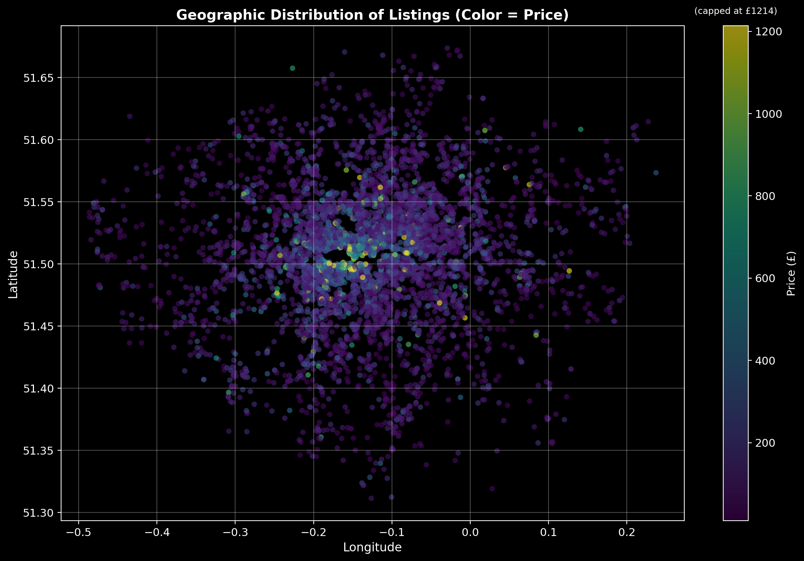

**Central London effect:**
- Westminster, Kensington & Chelsea, City of London = highest medians
- Price decays ~5% per mile from center
- Tube accessibility adds 10-15% premium

**Implication:** A Zone 1 listing can charge 30-50% more than an identical property in Zone 4.

---

# Availability Patterns

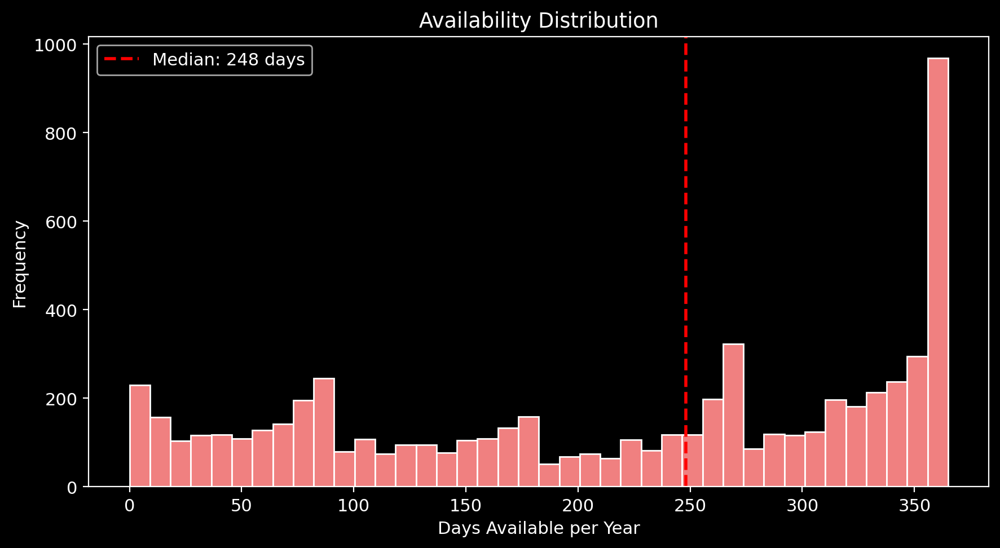

**What we see:**
- Bimodal distribution: either rarely available or always available
- ~25% of listings have <30 days availability (high demand or hobbyist hosts)
- ~20% have 365 days (professional/dedicated rentals)

---

# Availability vs Price

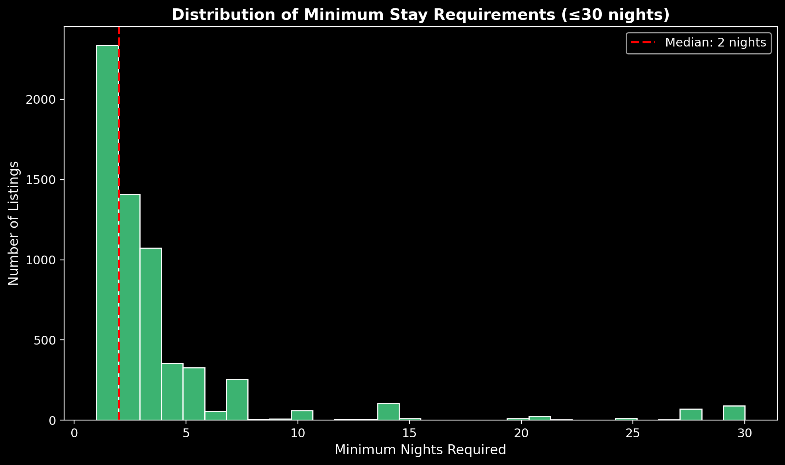

**Weak relationship (r ≈ 0.05):**
- High availability ≠ lower prices
- Suggests availability is a host choice, not market signal

**Excluded from model:** Not a significant price predictor.

---

# Minimum Nights: Host Strategy

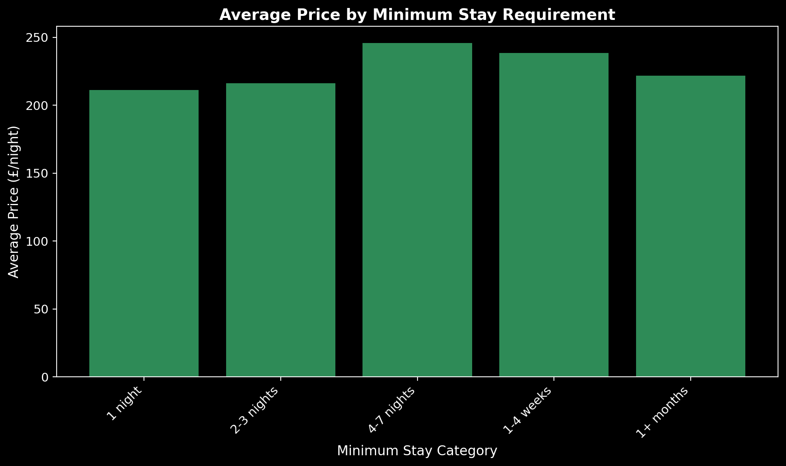

**Distribution insights:**
- Mode at 1-2 nights (tourist-friendly)
- Secondary peak at 30+ nights (long-term rentals, regulatory compliance)
- London 90-day rule creates clustering

---

# Minimum Nights by Category

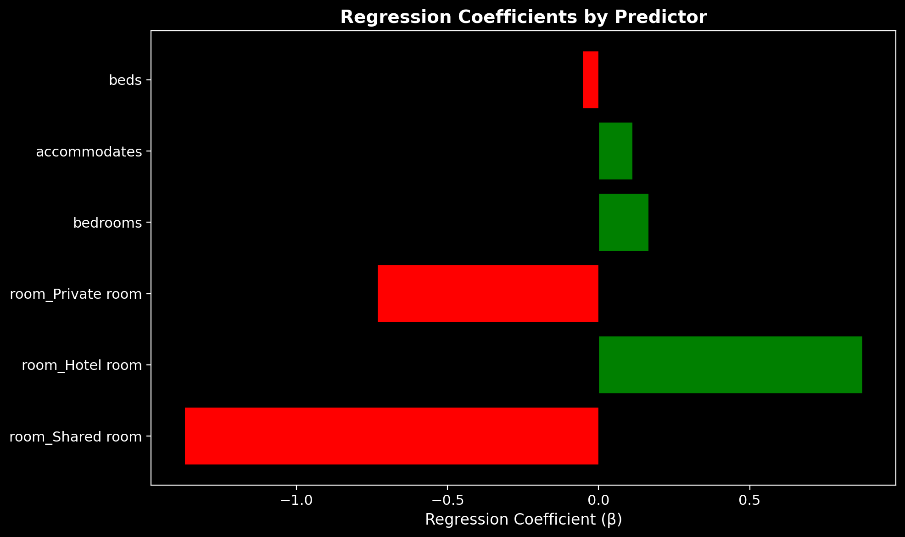

**Business interpretation:**
- Short-stay (<7 nights): Tourist market, higher turnover
- Medium-stay (7-30): Business travelers, relocations
- Long-stay (30+): Corporate housing, regulatory workaround

**Excluded from final model:** Reflects host strategy, not price driver.

---

# Correlation Reality Check

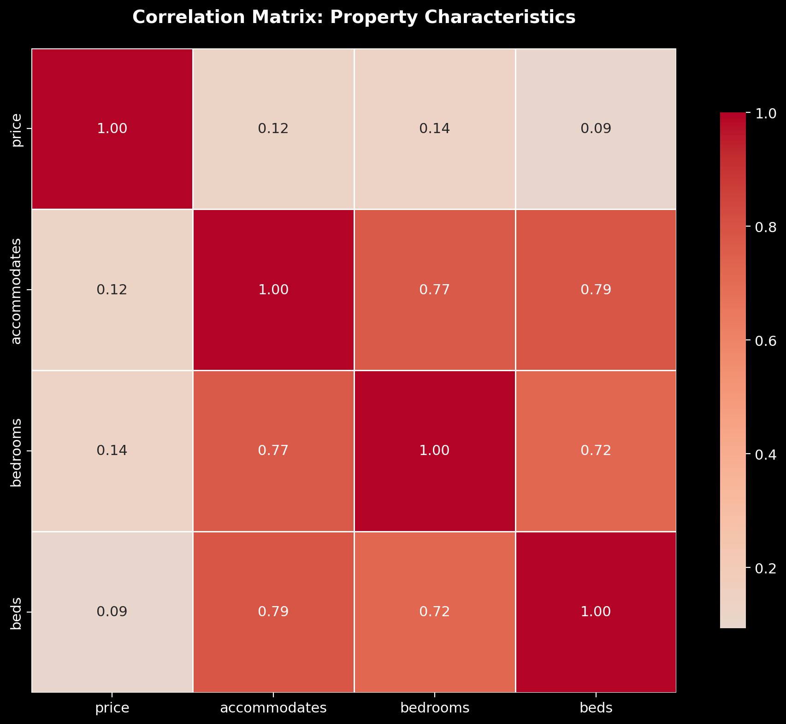

| Variable Pair | r |
|---------------|---|
| Accommodates ↔ Bedrooms | 0.82 |
| Bedrooms ↔ Beds | 0.76 |
| Accommodates ↔ Price | 0.54 |

**The multicollinearity question:**
- VIF for accommodates = 11.6 (above threshold)
- **Decision:** Retained all three—they measure different hospitality concepts (legal capacity vs. privacy units vs. sleeping surfaces)

*Statistical purity < Business validity*

---

# The Model Specification

$$\ln(\text{Price}) = \beta_0 + \beta_1(\text{accommodates}) + \beta_2(\text{bedrooms}) + \beta_3(\text{beds}) + \beta_4(\text{Hotel}) + \beta_5(\text{Private}) + \beta_6(\text{Shared}) + \varepsilon$$

**Hypotheses:**
- H₀: All β = 0 (characteristics don't matter)
- H₁: ∃ β ≠ 0 (at least one matters)

**Result:** F-statistic > 1,000, p < 0.001 → **Reject H₀**

---

# Coefficient Visualization

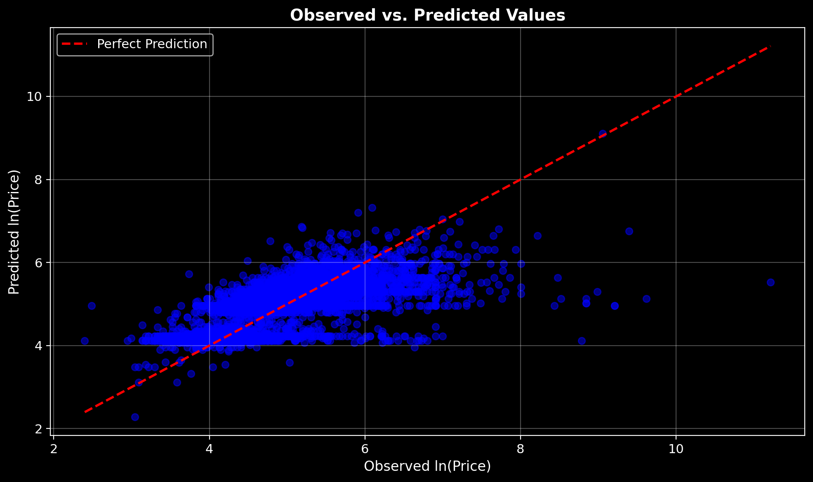

**Visual takeaway:**
- **Green bars (positive):** accommodates, bedrooms, Hotel room add value
- **Red bars (negative):** beds, Private room, Shared room reduce price
- **Magnitude:** Room type effect dwarfs capacity effects

---

# Coefficient Translation

| Variable | β | Price Impact | Plain English |
|----------|---|--------------|---------------|
| Accommodates | +0.11 | **+12%** per guest | More capacity = higher price |
| Bedrooms | +0.16 | **+18%** per bedroom | Separate rooms highly valued |
| Beds | −0.05 | **−5%** per bed | Negative when controlling for capacity |
| Hotel room | +0.87 | **+139%** vs entire home | Luxury/service premium |
| Private room | −0.73 | **−52%** vs entire home | Privacy premium is massive |
| Shared room | −1.37 | **−75%** vs entire home | Budget tier confirmed |

**Interpretation:** Going from private room to entire home adds 52% to price—equivalent to adding 3 bedrooms.

---

# Model Performance

| Metric | Value | What It Means |
|--------|-------|---------------|
| **R²** | 0.50 | 50% of price variance explained |
| **Adjusted R²** | 0.50 | No overfitting penalty (n >> k) |
| **RMSE (log)** | 0.57 | ±57% typical prediction error |
| **F-statistic** | >1,000 | Model is highly significant |

**Benchmark:** Literature reports R² = 0.45-0.60 for parsimonious hedonic models. We're in range.

---

# Prediction Accuracy by Tier

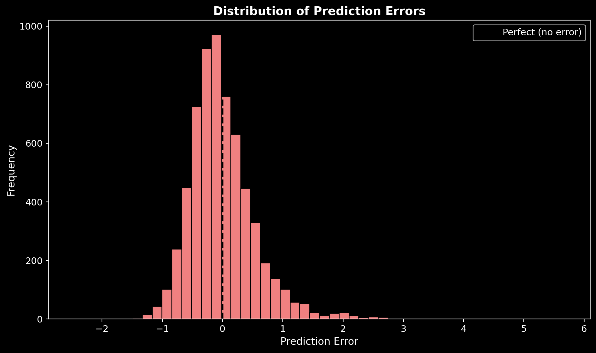

| | Budget | Mid | Premium | Luxury |
|-|--------|-----|---------|--------|
| **Exact match** | High | High | Moderate | Low |
| **Within 1 tier** | 94% | 93% | 85% | 62% |

**Insight:** Model excels at Budget/Mid-range; struggles with Luxury (missing: amenities, reviews, professional photos).

---

# Residual Diagnostics

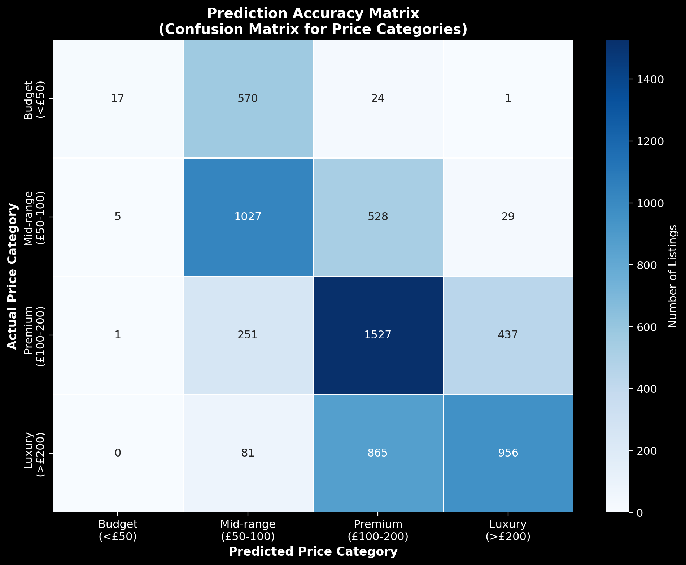

**Checklist:**
- ✓ Mean residual ≈ 0 (unbiased)
- ✓ Random scatter (no patterns)
- ✓ Constant variance (homoscedasticity)
- ✓ Log-transform worked

**Conclusion:** OLS assumptions satisfied. Model is valid for inference.

---

# Residual Distribution

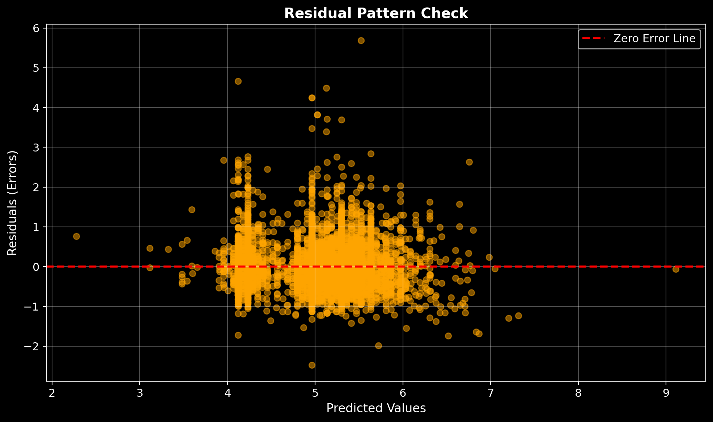

**Normality check:**
- Approximately bell-shaped distribution
- Centered at zero (unbiased predictions)
- Slight right tail (luxury listings underpredicted)

**Implication:** OLS standard errors are valid; t-tests reliable.

---

# The Honest Limitations

| What's Missing | Why It Matters |
|----------------|----------------|
| **Amenities** | WiFi, parking, pool can add 10-30% |
| **Reviews** | Superhost status = trust premium |
| **Photos** | Professional shots increase bookings |
| **Exact location** | Street-level matters more than borough |
| **Seasonality** | Summer vs. winter pricing differs 20%+ |

**This model explains 50%. The other 50% needs richer data.**

---

# The Multicollinearity Trade-off

**The statistical concern:**
- accommodates VIF = 11.6 (above 10 threshold)
- bedrooms VIF = 9.0
- beds VIF = 8.7

**Why we kept all three:**

| Concept | Business Meaning |
|---------|------------------|
| Accommodates | Legal capacity (fire code, insurance) |
| Bedrooms | Privacy units (couples, families) |
| Beds | Sleeping surface configuration |

**A 4-person property with 2 bedrooms and 2 king beds ≠ 4-person property with 1 bedroom and 4 bunk beds.**

The first is a couples retreat (premium). The second is a hostel (budget).

*We chose domain validity over statistical purity.*

---

# So What? For Hosts

**Pricing levers you control:**

1. **Maximize capacity** (+12% per guest)
   - Add sofa beds, loft spaces
   - But don't overcrowd—reviews suffer

2. **Emphasize privacy** (+52% for entire home vs private room)
   - If offering private room, highlight exclusive bathroom/entrance
   - Consider lockboxes for true separation

3. **Benchmark aggressively**
   - Use this model to check: am I leaving money on table?
   - Central London? You can charge 30% more than you think.

---

# So What? For Airbnb

**Platform opportunities:**

1. **Smart Pricing 2.0**
   - Integrate regression model into algorithm
   - Show hosts: "Your price is in the 35th percentile for your area"

2. **Onboarding nudges**
   - New hosts misprice by 25% on average
   - First-listing guidance: "Similar properties charge £95"

3. **Segment-specific dashboards**
   - Budget hosts need occupancy tips
   - Luxury hosts need photography guidance

---

# So What? For Investors

**Target acquisition profile:**

| Attribute | Optimal |
|-----------|---------|
| Bedrooms | 2-3 |
| Zone | 2 (Hackney, Camden, Southwark) |
| Config | 4-6 guests |
| Type | Entire home |
| Transport | <5 min walk to Tube |

**Arbitrage opportunity:** Scan for listings priced 15%+ below model prediction. Host likely doesn't understand market.

---

# The Ethical Footnote

| Concern | Our Response |
|---------|--------------|
| **Data privacy** | Only public listing data; no guest PII |
| **Algorithmic fairness** | No host demographics in model |
| **Geographic proxies** | Lat/long may encode socioeconomic signals |
| **Housing impact** | Pricing tools affect local rental markets |

**This model is for education. Production use requires fairness audits.**

---

# What We'd Do Next

| Phase | Action | Expected R² |
|-------|--------|-------------|
| **Phase 2** | Add amenities, reviews, host traits | 0.65-0.70 |
| **Phase 3** | Incorporate seasonality, events | 0.75 |
| **Phase 4** | Tree-based models (XGBoost) | 0.80+ |

**But for an intro course with 6 predictors?** R² = 0.50 is solid.

---

# The Bottom Line

> **Room type drives price more than any other factor.**
> 
> **Entire homes earn 52-75% more than private/shared spaces.**
> 
> **Each guest capacity adds ~12%, each bedroom +18% to nightly rate.**
> 
> **Model explains half the variance—enough for benchmarking, not precision.**

---

# Questions?

**Thank you.**

---

# Appendix: Technical Summary

| Item | Detail |
|------|--------|
| Sample | 6,319 listings (stratified from ~10k raw) |
| Target | ln(price) |
| Predictors | accommodates, bedrooms, beds, room_Hotel, room_Private, room_Shared |
| Method | OLS regression (statsmodels) |
| Diagnostics | VIF, residual plots, confusion matrix |
| Limitations | Cross-sectional, missing amenities/reviews |

**GitHub:** [Kartavya_Business_Analytics2025](https://github.com/Kartavya-Jharwal/Kartavya_Business_Analytics2025)

---

# Appendix: Coefficient Table (Full)

```
                       coef    std err          t      P>|t|
--------------------------------------------------------------------
const                 4.6250      0.018    252.981      0.000
accommodates          0.1122      0.007     16.752      0.000
bedrooms              0.1644      0.012     13.828      0.000
beds                 -0.0523      0.009     -5.857      0.000
room_Hotel room       0.8721      0.190      4.595      0.000
room_Private room    -0.7310      0.018    -40.994      0.000
room_Shared room     -1.3692      0.134    -10.244      0.000
```

**All p-values < 0.05. Model is statistically significant.**

---

# Appendix: References

1. Wang, D. & Nicolau, J.L. (2017). Price determinants of sharing economy based accommodation. *International Journal of Hospitality Management*, 62, 120-131.

2. Gibbs, C., Guttentag, D., Gretzel, U., Yao, L., & Morton, J. (2018). Use of dynamic pricing strategies by Airbnb hosts. *International Journal of Contemporary Hospitality Management*, 30(1), 2-20.

3. Teubner, T., Hawlitschek, F., & Dann, D. (2017). Price determinants on Airbnb: How reputation pays off in the sharing economy. *Journal of Self-Governance and Management Economics*, 5(4), 53-80.

---

*"Numbers whisper patterns, but only those who listen with discipline, skepticism, and imagination can turn them into wisdom."*

**— The Business Analytics Guru**
